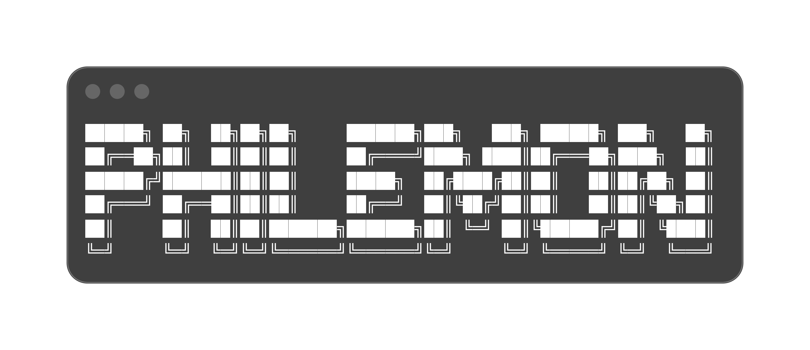

<div align="center">


<br/>

[](https://github.com/Philemon12421)
[](https://github.com/Philemon12421)
[](https://github.com/Philemon12421)
[](https://knust.edu.gh)

</div>

---


##  About Me

<table>
<tr>
<td width="55%" valign="top">

```typescript
const philemon = {
  name:       "Philemon Osei Kusi",
  location:   "Kumasi, Ghana 🇬🇭",
  university: "KNUST — Computer Science",
  roles: [
    "Full-Stack Engineer",
    "Cybersecurity Blue Team Lead",
    "Digital Forensics Expert",
    "Creative Director @ Ocean Graphix",
  ],
  currentFocus: [
    "Java Mastery & Backend Security",
    "Forensic Analysis & Blue Team Ops",
    "Building Totti — 100+ free web tools",
  ],
  funFact: "I treat code like art 🎨",
  motto:  "Build it. Harden it. Ship it.",
};
```

</td>
<td width="45%" align="center" valign="top">


<br/><br/>

> *"Technology is the canvas;<br/>code is the paint.<br/>I create masterpieces<br/>that are bulletproof."*

</td>
</tr>
</table>


##  Specialized Skillset

<div align="center">

| 🌐 **Full-Stack Dev** | 🛡️ **Cybersecurity** | 🎨 **Creative Design** |
|:---|:---|:---|
| React / JavaScript / TypeScript | Kali Linux / Metasploit | UI/UX — Figma / Adobe XD |
| Node.js / Django / REST APIs | Wireshark / Nmap / Burp Suite | Premiere Pro / CapCut |
| Java / Python / C++ | Digital Forensics & OSINT | Blender 3D / Photoshop |
| MongoDB / PostgreSQL / Docker | Blue Team Operations | Ocean Graphix & Drench |
| AWS / Vercel / CI-CD | Incident Response & Threat Intel | Brand Identity Design |

</div>


##  Tech Stack

<div align="center">

**Languages**


**Frontend**


**Backend & Cloud**


**Security & Forensics**


**Design & Creative**


</div>


##  GitHub Stats

<div align="center">


<br/>


<br/>


</div>


## 🚀 Featured Projects

<div align="center">

| 🛠️ Project | 📝 Description | 🔧 Stack | 🌐 Link |
|:---|:---|:---|:---|
| **Totti** | 100+ free browser-based tools — crypto, dev, productivity & YouTube | React, TypeScript, Vite, Vercel | [tottti.vercel.app](https://tottti.vercel.app) |
| **Ocean Graphix** | Creative design studio & brand identity agency | Figma, Photoshop, Blender | *In progress* |
| **Drench** | Creative multimedia production brand | Premiere Pro, After Effects | *In progress* |

</div>


## 🏆 Achievements & Trophies

<div align="center">


</div>


## 🎬 Connect & Collaborate

<div align="center">

[](https://www.linkedin.com/in/philemon-osei-kusi-5970a6343)
[](https://www.youtube.com/@philemon4u1)
[](https://instagram.com/philemon4u1)
[](https://x.com/philemonku86576)
[](https://github.com/Philemon12421)
[](mailto:philemonkusi292@gmail.com)

</div>

<br/>

<div align="center">

> [!TIP]
> 💼 **Open to:** Full-Stack roles · Security engagements · Freelance projects · Collaborations
>
> 📧 **Email:** philemonkusi292@gmail.com
>
> 🌐 **Live Project:** [tottti.vercel.app](https://tottti.vercel.app) *(Totti — 100+ free tools)*

</div>


<div align="center">


<br/><br/>


<br/><br/>


</div>
